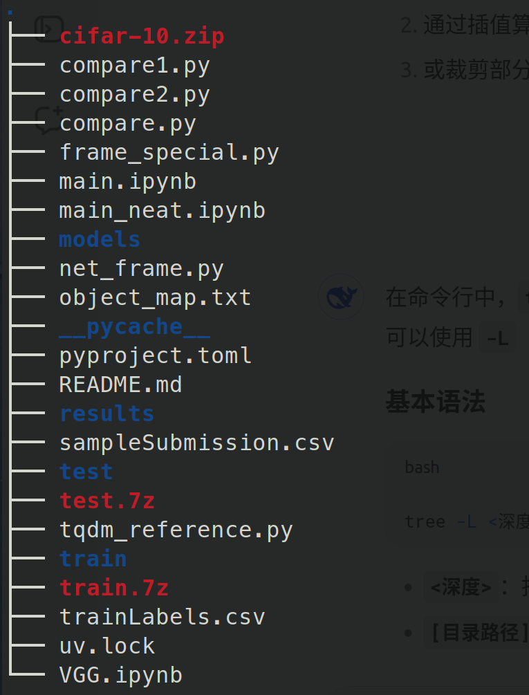
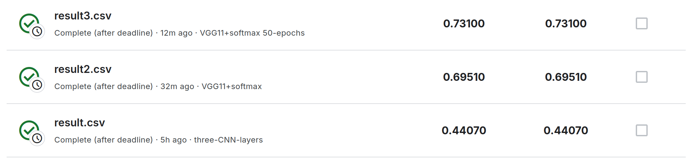

## 我的kaggle比赛之——CIFAR-10 - Object Recognition in Images

比赛地址：https://www.kaggle.com/competitions/cifar-10

### 背景

虽是13年的比赛了，但是参加一下还是有收获的.
- 提高了对pytorch使用的熟练度
- 对不同网络结构的理解加深
- 学会在深度学习框架中添加tqdm，实现训练可视化

### 目录结构

几个重要的文件说明

- 红色的几个压缩包为原始数据集(github上被忽略)
- *.ipynb为主要的比赛实现代码
- net_frame.py、frame_special.py为主要框架代码
- object_map.txt为类别映射文件

- **pyproject.toml**为运行上面代码需要的python环境

### 模型介绍

本次比赛尝试了两种模型，分别在main.ipynb与VGG.ipynb中，实现的是简单的3层卷积网络与VGG11.

- 5.5 2025 新增NIN网络模型，在训练集上成功率达到98%

### 最终的提交结果

**注意:VGG11还未收敛，还有提升空间!**
